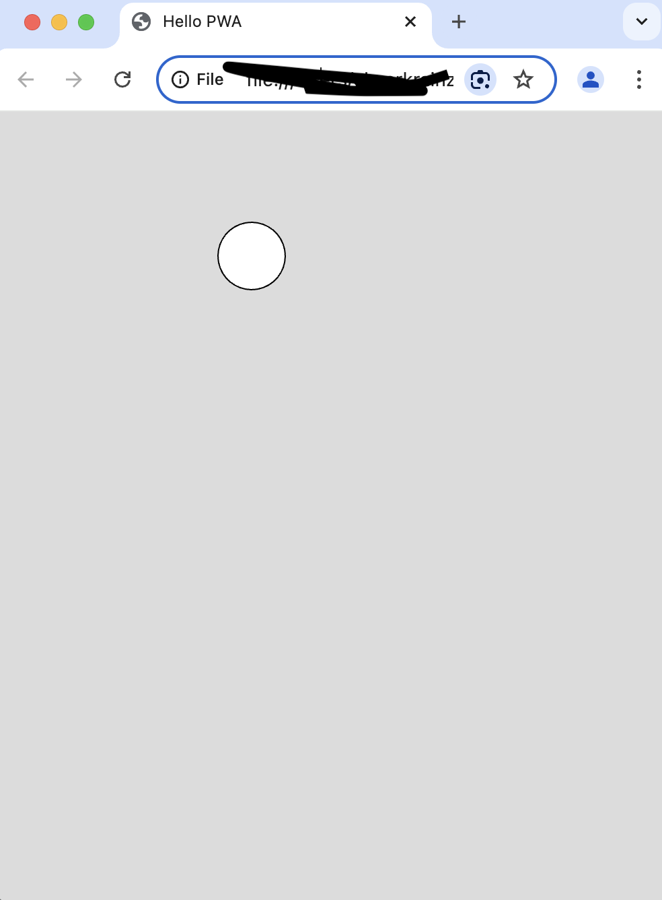

# MinimalPWA_P5

This shows a scaffold for PWA with p5.js.

P5.js is a JS tool for intuitive canvasbased programming in Javascript [https://p5js.org/](https://p5js.org/).


PWA is a progressive web app, an web application with the behavior of native apps based ([https://developer.mozilla.org/en-US/docs/Web/Progressive_web_apps](https://developer.mozilla.org/en-US/docs/Web/Progressive_web_apps))


## Installation 

Copy the complete folder on a webserver or start a local webserver. open the app in the browser




## Overview

```index.html``` is the basic website and starting point of the app.

```sw.js``` basic JS function

```manifest.json```PWA configuration

```js/main.js``` PWA configuration & Service Worker

```js/sketch.js``` entry point of P%.js

```css/``` styles of the web app


